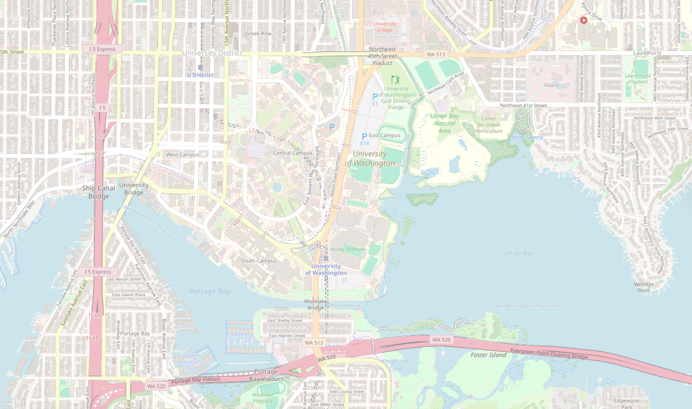
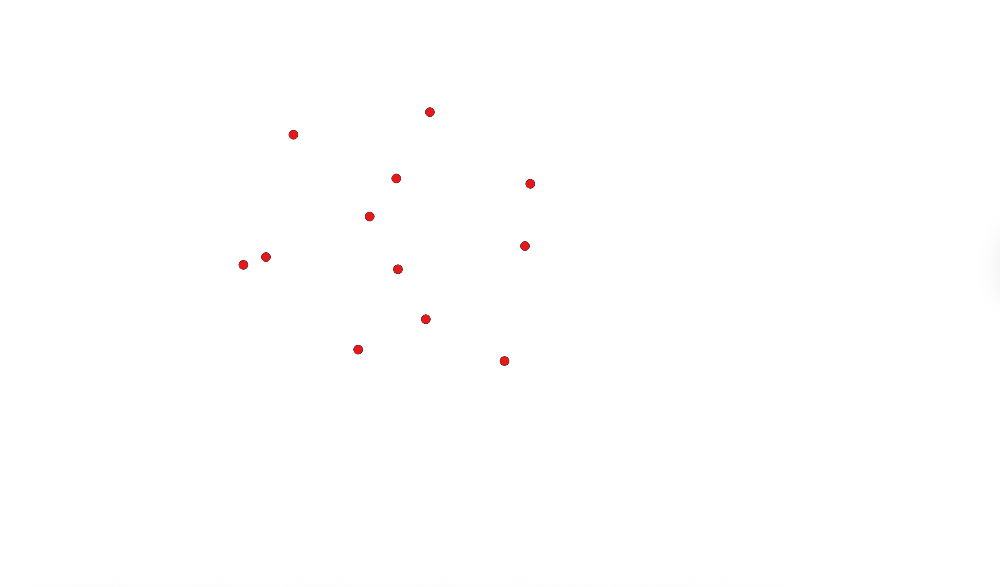
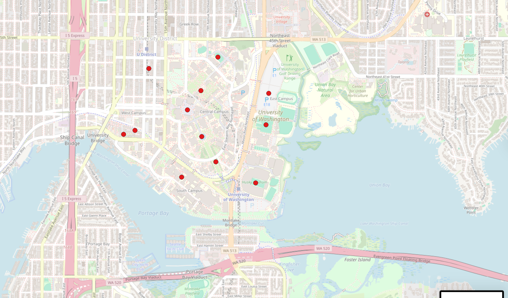
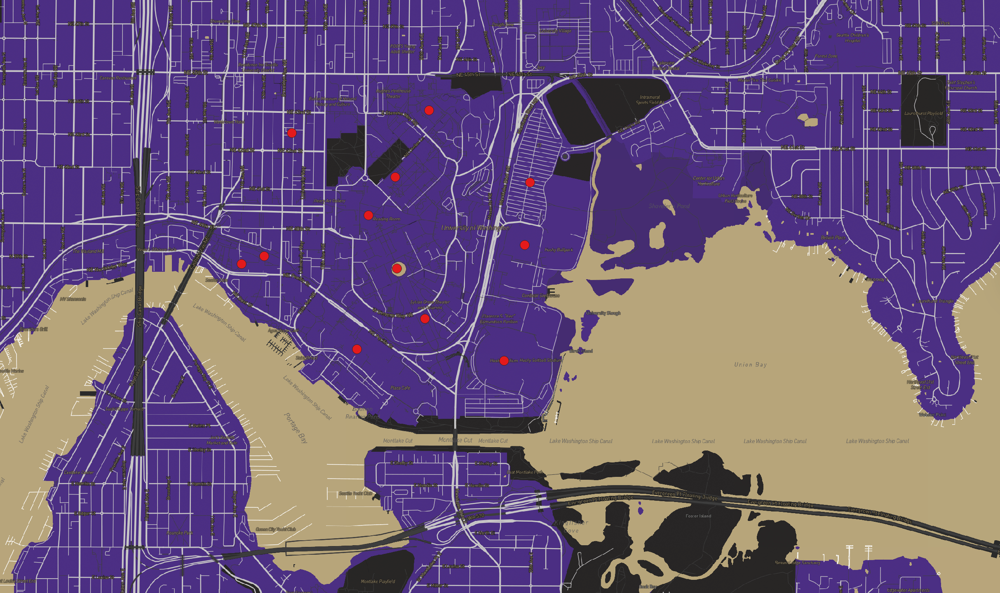

# Lab 4: Map Design and Tile Generation

## Web Map URL

Live web map:  
https://nalemu13.github.io/lab4-tiles

This repository hosts an interactive web map built with Mapbox GL JS that displays four raster tile sets generated in QGIS.

---

## Examined Geographic Area

The examined geographic area focuses on the University of Washington campus and the surrounding Seattle area. The map centers on UW to support campus scale exploration while still showing nearby urban context. This study area was selected to keep the tile export size manageable and to allow detailed visualization at different zoom levels.

---

## Tile Sets and Zoom Levels

All four tile sets were exported in Web Mercator (EPSG:3857) using the same geographic extent.  
Available zoom levels for each tile set: **12 to 16**

### Tile Set 1: Custom Basemap

This tile set is a lightly customized basemap. It provides geographic context such as roads, buildings, and labels using a simplified realistic color scheme to improve readability.

---

### Tile Set 2: Thematic Layer

This tile set displays a thematic geospatial dataset created and styled in QGIS. The layer highlights a specific geographic pattern within the UW study area using custom symbology.

---

### Tile Set 3: Basemap and Thematic Combination

This tile set combines the basemap and thematic dataset into a single integrated map. It supports interpretation by showing both contextual and thematic information together.

---

### Tile Set 4: UW Themed Map Design

This tile set is a UW, purple & gold, themed visual design created in Mapbox Studio. The style uses coordinated colors and labels to communicate a specific visual theme relevant to the project.

---
